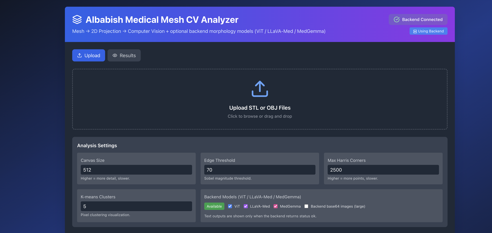
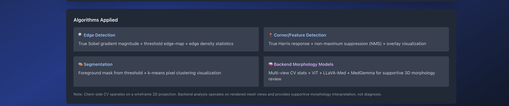

# Albabish Medical Mesh CV Analyzer

A web-based tool for **3D medical mesh morphology analysis** using classical computer vision and optional multimodal AI models.

It supports **STL** and **OBJ** mesh files, renders them into 2D projections, extracts geometric and visual features, and optionally generates **medical morphology summaries** using backend models such as **ViT**, **LLaVA-Med**, and **MedGemma**.

---

## What this project does

This application analyzes reconstructed 3D anatomical meshes and produces a structured morphology review.

### Client-side pipeline
- Loads **STL** or **OBJ** meshes
- Renders a wireframe 2D projection in the browser
- Computes:
  - Sobel-based edge magnitude
  - thresholded edge map
  - Harris corner detection
  - foreground segmentation
  - K-means pixel clustering

### Backend pipeline
- Loads the uploaded mesh with `trimesh`
- Computes mesh-level geometry:
  - vertices
  - faces
  - surface area
  - volume
  - watertightness
  - Euler number
- Renders multiple 2D views
- Computes multi-view CV statistics:
  - edge density
  - feature counts
  - contour summaries
  - segmentation cluster summaries

### Optional AI-assisted interpretation
- **ViT** for visual embedding / generic classification
- **LLaVA-Med** for supplemental multimodal interpretation
- **MedGemma** via Ollama for medical morphology-oriented text summaries

---

## Why this project exists

Medical segmentation outputs are often difficult to inspect quickly, especially when working with 3D surfaces exported as meshes.

This project was built to help with:

- **surface morphology review**
- **mesh quality inspection**
- **branching / lobulation / irregularity detection**
- **topology-aware anatomical plausibility checks**
- **AI-assisted descriptive summaries in medical terminology**

The goal is **not diagnosis**, but rather:
- better review of reconstructed anatomical surfaces
- better segmentation-quality interpretation
- faster exploratory inspection of 3D medical meshes

---

## Supported formats

- `.stl`
- `.obj`

---

## Screenshots

### Main interface


### Analysis settings and algorithms section


---

## Example outputs

The application can generate:
- mesh geometry summaries
- edge density and contour statistics
- Harris corner counts
- multi-view morphology summaries
- AI-generated descriptive reports using medical terminology

Example report sections:
- Study File
- Client-Side Mesh and Image Analysis
- Backend Morphology Analysis
- Mesh Reconstruction Summary
- Aggregate Morphology Signal Summary
- MedGemma Structured Morphology Review
- LLaVA-Med Supplemental Interpretation
- Visual Classification / Embedding
- Interpretive Caveats

---

## Project structure

```text
AlbabishMeshProject/
├── backend/
│   ├── app.py
│   ├── vit_infer.py
│   ├── llava_med_infer.py
│   ├── medgemma_infer.py
│   ├── uploads/
│   └── outputs/
├── frontend/
│   ├── src/
│   │   └── MedicalMeshCVAnalyzer.jsx
│   ├── public/
│   └── package.json
├── assets/
│   ├── ui-main.png
│   └── ui-settings.png
└── README.md


---

## 3) Git commands to push to GitHub

From the project root:

```bash
git status
git add .
git commit -m "Add OBJ support, screenshots, and README for medical mesh CV analyzer"
git push origin main